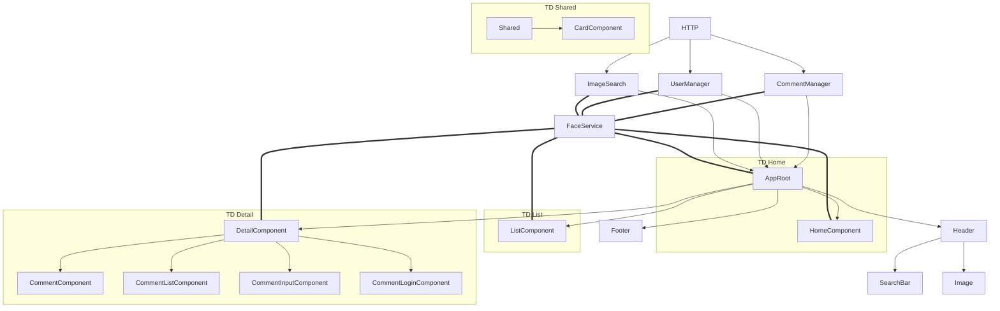

* App qui déchire !
* Sur l'astronomie...

* Source 
    * https://images-api.nasa.gov/search?q=aldebaran

Une app quire permet la recherche et la présentation des résultats sous forme de liste cliquable.

Avec l'ajout de commentaire.

Avec une forme simple d'identification.

# Container vs Component

ou Dumb vs Smart

# Entité(s)

Action
   type
   data
   result?

image
  id?
  url
  title
  comments
  description

comment
  id?
  text
  user
  date

user
  id?
  name

# Service

HTTP

ImageSearch
UserManager
CommentManager

## Plan 

    ImageSearch===HomeComponent;
    ImageSearch===AppRoot;
    ImageSearch===ListComponent;
    ImageSearch===DetailComponent;
    UserManager===DetailComponent;
    CommentManager===DetailComponent;
